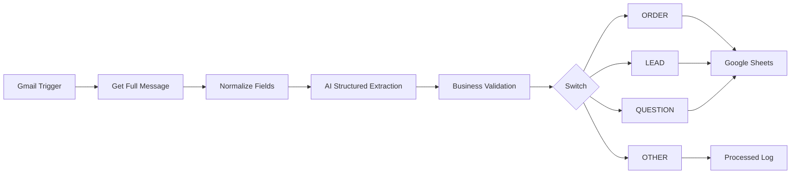

# Gmail AI CRM Automation

An n8n portfolio project for automatically processing incoming business emails, extracting structured data with AI and routing messages according to deterministic business rules.

## Project Goal

Business inboxes can contain orders, leads, questions and unrelated messages.

Manually reviewing every email, extracting customer information and copying data into a CRM or spreadsheet takes time and can lead to mistakes.

The goal of this project was to automate the full processing pipeline while keeping important business decisions outside the AI model.

## Workflow Architecture



## What the Workflow Does

1. Detects a new Gmail message.
2. Retrieves the complete message content.
3. Normalizes fields required for downstream processing.
4. Sends the email text to an AI model.
5. Extracts structured information using a Structured Output Parser.
6. Applies additional deterministic validation.
7. Classifies the message as:
   - `ORDER`
   - `LEAD`
   - `QUESTION`
   - `OTHER`
8. Routes the result to the appropriate workflow branch.
9. Writes structured business data to Google Sheets.
10. Records processed Gmail message IDs to prevent duplicate processing.

## Structured Data Extraction

The AI workflow extracts fields such as:

```json
{
  "name": "Customer name",
  "product": "Product",
  "quantity": 2,
  "price": 1500,
  "phone": "+380..."
}
```

Missing text fields are normalized as empty strings and missing numeric values as `0`.

## Deterministic Business Validation

The AI classification is not trusted blindly.

For example, a message can only become an `ORDER` when all required information is available.

Conceptually:

```javascript
name &&
product &&
quantity > 0 &&
price > 0 &&
phone
```

If the AI predicts `ORDER`, but required fields are missing, the workflow changes the final classification to `LEAD`.

This keeps important business logic deterministic instead of allowing the LLM to make the final decision alone.

## Routing

The workflow uses:

- IF nodes
- Switch nodes
- Expressions
- Structured Output
- Business validation

Example message types:

```text
ORDER
LEAD
QUESTION
OTHER
```

Each type can be routed to its own processing branch.

## Duplicate Protection

To prevent the same email from being processed multiple times, the workflow stores the Gmail message ID in a separate processed-email log.

Conceptual flow:

```text
New Email
   ↓
Get Gmail Message ID
   ↓
Search Processed Emails
   ↓
Already exists?
   ├── YES → Stop
   └── NO  → Continue processing
```

The message ID is added to the processed log only after successful workflow processing.

## Spam Folder Processing

A separate scheduled workflow checks the Gmail spam folder periodically.

The workflow:

1. Runs on a schedule.
2. Retrieves recent spam messages.
3. Checks whether each message was already processed.
4. Sends new messages through the same processing logic.

This avoids relying only on the standard Gmail Trigger.

## Error Handling

The project includes reliability features such as:

- Retry On Fail
- delayed retries
- global Error Workflow
- Gmail error notifications
- protection against error-notification loops

Example retry strategy:

```text
Request fails
     ↓
Wait
     ↓
Retry
     ↓
Continue or trigger Error Workflow
```

A special check prevents error-notification emails from being processed again by the normal AI workflow.

## Technologies Used

- n8n
- Gmail
- Google Sheets
- OpenAI / LLM
- Structured Output Parser
- JSON
- Expressions
- IF
- Switch
- Merge
- Schedule Trigger
- Error Trigger

## Skills Demonstrated

This project demonstrates practical experience with:

- workflow architecture;
- email automation;
- AI data extraction;
- structured JSON;
- deterministic business rules;
- routing logic;
- deduplication;
- scheduled processing;
- retry strategies;
- error handling;
- Google Sheets integration.

## Possible Next Improvements

- Replace Google Sheets with PostgreSQL.
- Connect HubSpot or Pipedrive.
- Add execution monitoring and analytics.
- Add a real customer database.
- Deploy n8n on a self-hosted VPS.
